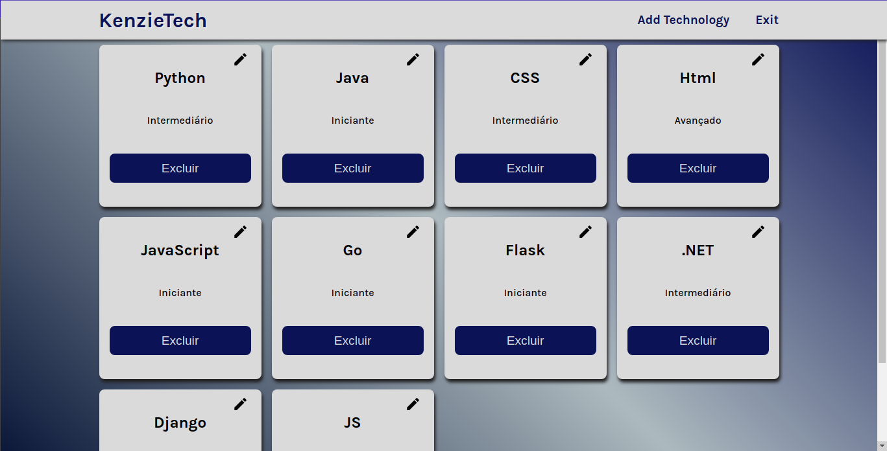

# Kenzie Tech

<!---Esses são exemplos. Veja https://shields.io para outras pessoas ou para personalizar este conjunto de escudos. Você pode querer incluir dependências, status do projeto e informações de licença aqui--->

> Projeto desenvolvido de uma forma que possa trazer uma organização para os devs cadastrarem as tecnologias que utilizam atualmente

### Ajustes e melhorias

O projeto ainda está em desenvolvimento e as próximas atualizações serão voltadas nas seguintes tarefas:

- [ ] feature: Adicionar uma imagem para perfil
- [ ] feature: Alterar as informações pessoais do usuário
- [ ] feature: Visulizar a ultima alteração de uma tecnologia
- [ ] fix: Melhorar a estilização da página inicial
- [ ] fix: Refatorar para TypeScript
- [ ] fix: Adicionar testes de integração - Login
- [ ] fix: Adicionar testes de integração - Dashboard
